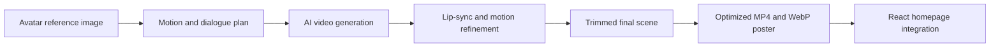

# Yashasvini Bhanuraj | Interactive Portfolio

<p align="center">
  
</p>

I wanted my portfolio to feel like a personal introduction, not simply a
collection of information. The central feature is therefore a cinematic,
animated homepage video in which my avatar begins at the laptop, looks toward
the visitor, and introduces me with synchronized speech and natural movement.

## Creating the Animated Introduction

The video began with a carefully planned sequence:

1. The avatar types on the laptop briefly before speaking.
2. She stops typing and naturally looks toward the camera.
3. Her facial expression, head movement, blinking, hand gestures, and lip
   movement follow the spoken introduction.
4. The scene ends with her eyes open and a natural smile, creating a clean
   final frame when playback stops.

I used the original avatar artwork as the reference frame and developed the
animation through an image-to-video workflow in **Kling AI**. Several versions
were tested and refined to improve facial consistency, pronunciation, lip
synchronization, eye movement, hand positioning, and the transition from
typing to speaking.

The final audio is embedded directly in the MP4. This means the speech and lip
movement remain synchronized during playback instead of being generated by the
website in real time.



## Preparing the Video for the Web

The completed animation was prepared as a web-friendly **MP4**, accompanied by
a lightweight **WebP poster**. The poster appears immediately while the video
loads, preventing an empty or flashing background on slower connections.

The final clip was also trimmed deliberately. Unwanted closing frames were
removed so the avatar finishes with open eyes and a smile. Compression and
framing were balanced carefully so the video remained clear without becoming
unnecessarily heavy for a portfolio homepage.

## Integrating It into the Homepage

The video is integrated as part of the homepage composition, rather than
displayed as a separate rectangular media player. A React and TypeScript
component controls playback, sound, visibility, and replay behaviour.

```tsx
<video
  ref={videoRef}
  className="hero-background-video"
  src="/yashasvini-cinematic-intro-4k.mp4"
  poster="/yashasvini-cinematic-poster-4k.webp"
  autoPlay
  playsInline
  preload="auto"
/>
```

CSS layering, responsive positioning, gradients, and carefully adjusted video
cropping blend the scene into the homepage. The text remains readable while
the avatar, laptop, hands, and coffee mug stay visible across different screen
sizes. The result feels like the character belongs inside the interface rather
than like a video placed on top of it.

## Making the Experience Interactive

The video behaviour is controlled with the browser's **Intersection Observer
API**:

- It starts when the homepage becomes active.
- It pauses after the visitor leaves the homepage.
- It restarts from the beginning when the visitor returns.
- A small mute/unmute control gives the visitor direct sound control.
- If a browser blocks audible autoplay, the video falls back safely and sound
  can be enabled with the control.

Audible autoplay is restricted by many browsers until the visitor interacts
with a page. The fallback was added to respect this browser rule while keeping
the introduction as seamless as possible.

## Challenges and Solutions

| Challenge | Approach |
| --- | --- |
| Keeping the avatar visually consistent | Reused the same reference image and refined multiple generated versions |
| Matching speech with mouth movement | Selected the strongest generated lip-sync result and kept audio inside the final MP4 |
| Creating a natural ending | Trimmed the clip to finish with open eyes and a smile |
| Preventing a blank frame while loading | Added an optimized WebP poster image |
| Blending video and interface | Used responsive video positioning, overlays, gradients, and text-safe spacing |
| Handling browser autoplay restrictions | Added an audible-play attempt, muted fallback, and sound control |
| Replaying the introduction naturally | Used Intersection Observer to restart it when the homepage becomes active again |

## Technologies Used for This Feature


## What I Learned

This was my first time integrating an AI-generated, speaking character into a
responsive web experience. The process helped me learn more about motion
planning, video framing, compression, audio and lip synchronization, browser
autoplay behaviour, responsive media positioning, and the difference between
simply displaying a video and designing it as part of an interface.

It became one of the most challenging and rewarding parts of building this
portfolio, combining creative experimentation with practical frontend
development.
